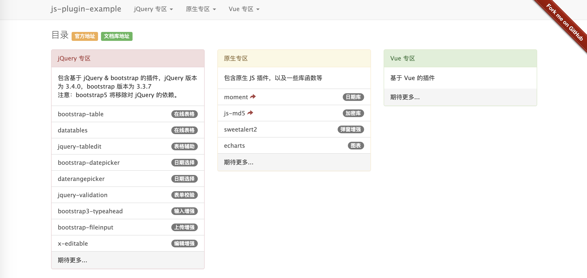

- JS 插件文档库地址：[文档库 · 语雀](https://www.yuque.com/pengloo53/web)
- 在线演示代码仓库：[文档库示例代码 · GitHub](https://github.com/pengloo53/js-plugin-example)
- 在线预览：[在线演示](http://js.90byte.com/page)

### 项目介绍
这是一个**文档协作**的项目，整理并记录优秀前端插件的**实战**使用方法，并提供在线演示，在线演示的原代码开源，感兴趣的话，可在本地开启服务，便于调试和学习。

该项目起于 jQuery & bootstrap 的相关框架，但绝不止于 jQuery，希望能覆盖所有优秀的 Web 前端框架。期待你的加入，共同维护文档。文档协作[邀请链接](https://www.yuque.com/g/pengloo53/web/collaborator/join?token=KfEcUOifDpWCQIrZ)，如果链接过期，可加作者微信号：**P_lu0503**，并备注：**文档协作**。

为了文档的可用性，我希望每一篇文档只对应一个 JS 插件，如有必要，另外提供在线演示页面。所以，项目分为两个部分：**文档部分**以及**演示部分**。截止编写该文档之时，已整理如下插件：

- bootstrap-table
- datatables
- jquery-tabledit
- bootstrap-datepicker
- daterangepicker
- jquery-validation
- bootstrap3-typeahead
- bootstrap-fileinput
- ...

演示页面如下图所示：

### 文档部分
文档托管在[语雀](https://www.yuque.com/pengloo53/web)平台上，期待你的加入，共同维护文档。由于大部分插件的参数较复杂，文档可能无法面面俱到，希望以**实战**的角度，写功能实现的案例。不要求所有的配置项都介绍到，列举一些最常用的即可。

故文档规范如下：

- 简单介绍：插件的用途，使用场景，以及官方文档链接；
- 开始准备：如何正确的引入库文件到页面中，这一点对于初学者很重要；
- 使用示例（需要代码演示）：
    - 前台 HTML 如何编写
    - 前台 JS 如何调用（不同的功能，分别介绍）
    - 后台数据返回的格式（不限后台技术，重点关注返回数据的格式）

### 演示部分
为了文档更加的直观，更具实战性质，如有必要，每一个插件都会提供一个独立的演示页面。在线演示的原代码放在 [GitHub](https://github.com/pengloo53/js-plugin-example) 上，采用 Node 语言编写，可以自行部署在本地，便于调试和学习。

熟悉 Node + Express 框架的可以直接 fork 项目，并提交 pull requests，如果不熟悉 Node 开发，也没关系，我会定期将文档中新增的插件，做成演示示例，push 到 GitHub 仓库。

另外，也提供了[在线预览](http://js.90byte.com/page)。

### 附：本地部署步骤
1. 安装 Node 环境
2. 安装 supervisor，安装方法：`npm i -g supervisor`
3. 安装 bower 包管理器，安装方法：`npm i -g bower`
4. 克隆代码到本地，顺便点个 Star
5. 进入项目目录，安装依赖，`npm install` 以及 `bower install`
6. 运行项目，`npm start`
7. 浏览器打开项目：`http://localhost:3030/page`

--- 
- JS 插件文档库地址：[文档库 · 语雀](https://www.yuque.com/pengloo53/web)
- 在线演示代码仓库：[文档库示例代码 · GitHub](https://github.com/pengloo53/js-plugin-example)
- 在线预览：[在线演示](http://js.90byte.com/page)